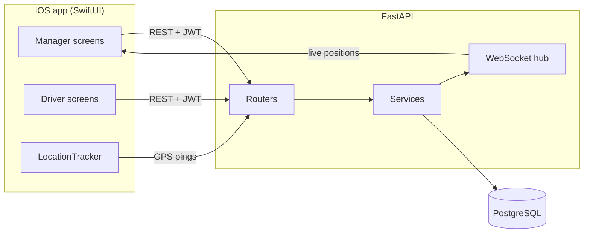

# Fleet Management Platform

An end-to-end fleet management system: a REST backend with a relational
database, and a native iOS app that serves both fleet managers and drivers.

Built for the SDE assignment brief — a logistics company that manages vehicles,
drivers, trips, fuel and maintenance on paper, and wants it digitised.

| | |
|---|---|
| **Backend** | Python 3.12 · FastAPI · SQLAlchemy 2.0 · Alembic · PostgreSQL (SQLite in dev) |
| **Mobile** | Swift 5 · SwiftUI · iOS 17+ · zero third-party dependencies |
| **Tests** | 122 backend tests, all passing |
| **API surface** | 53 REST endpoints + 1 WebSocket |

---

## Contents

- [Problem statement](#problem-statement)
- [What it does](#what-it-does)
- [Architecture](#architecture)
- [Technology choices](#technology-choices)
- [Database design](#database-design)
- [API documentation](#api-documentation)
- [Local setup](#local-setup)
- [Testing](#testing)
- [Deployment](#deployment)
- [Design decisions](#design-decisions)
- [Known limitations](#known-limitations)
- [Repository layout](#repository-layout)

---

## Problem statement

A logistics company runs a fleet of delivery vehicles. Vehicle records, driver
records, trip sheets, fuel and maintenance are all tracked by hand, which means
nobody can answer basic questions quickly: which vehicles are free right now,
which are overdue for a service, whose licence expires this month, how far the
fleet travelled today, and where a given lorry is at this moment.

This platform replaces that with a single system:

- **Fleet managers** maintain the vehicle and driver registers, assign vehicles
  to drivers for defined periods, schedule trips, watch vehicles move on a live
  map, log maintenance, triage the issues drivers report, and read a dashboard
  that aggregates it all.
- **Drivers** see the trips assigned to them, start and complete them with
  odometer readings, stream their position while driving, and report vehicle
  problems from the roadside.

The system has to *refuse* the mistakes that paper allows — the same vehicle
promised to two drivers for the same week, a trip marked complete that was never
started, a distance figure that does not match the odometer.

## What it does

### Fleet manager

| Area | Capability |
|---|---|
| Dashboard | Vehicle counts by status, active/scheduled trips, distance today, maintenance due, expiring documents, recent incidents |
| Vehicles | Add, edit, deactivate/reactivate, search by registration/make/model, filter by status |
| Drivers | Add (optionally with an app login), edit, activate/deactivate, view assignment history and performance |
| Assignments | Assign a vehicle to a driver for a date range, with overlap rejection; end early |
| Trips | Schedule, edit while scheduled, cancel, view the recorded route on a map |
| Live map | Every vehicle's latest position, updating over a WebSocket |
| Maintenance | Log services with cost and odometer, schedule the next one, see what is due |
| Incidents | Review driver reports, assign, progress, resolve |
| Analytics | Vehicle utilisation, distance, maintenance cost, cost per km, driver performance |

### Driver

| Area | Capability |
|---|---|
| My trips | Assigned trips grouped into in-progress, upcoming and history |
| Pre-trip | Vehicle, destination, scheduled time, trip details |
| Start trip | Records start time, GPS position and starting odometer |
| During trip | Position streamed every 15s, buffered and retried when offline; status updates |
| Complete trip | Records end time, position and odometer; distance computed server-side |
| Report an issue | Title, description and severity, tied to the vehicle and trip |
| My vehicle | The currently assigned vehicle and the driver's own reports |

### End-to-end flow

The brief's expected flow works end to end:

> Manager signs in → adds a vehicle → adds a driver → assigns the driver to the
> vehicle → creates a trip → driver signs in → sees the assigned trip → starts it
> → GPS updates flow → manager tracks the vehicle → driver completes the trip →
> distance is calculated automatically → driver reports an issue → manager
> creates a maintenance record → the dashboard reflects all of it.

## Architecture



Four layers, each depending only on the one below: **routing** (HTTP shape and
auth guards) → **schemas** (validation) → **services** (business rules) →
**models** (persistence). Routes are thin; every rule that could be got wrong
lives in a service function that is unit-testable without HTTP.

Full detail, sequence diagrams and the ER diagram: **[docs/architecture.md](docs/architecture.md)**.

## Technology choices

| Choice | Why | What else was considered |
|---|---|---|
| **FastAPI** | Generates OpenAPI from the same type hints that validate requests, so the docs cannot drift from the code. Pydantic gives declarative validation at the edge. | Django REST Framework — more batteries but heavier than this needs; Flask — would mean hand-writing validation and docs |
| **SQLAlchemy 2.0 + Alembic** | Typed `Mapped[...]` models, and versioned migrations so the schema is reproducible rather than implicit | Raw SQL (no migration story); Tortoise/SQLModel (smaller ecosystems) |
| **PostgreSQL, SQLite in dev** | Postgres for production; SQLite keeps `git clone && pytest` working with no services running. One `DATABASE_URL` switches them. | Postgres-only — correct for production but adds friction to review |
| **JWT (access + refresh)** | Stateless auth suits a mobile client; a short access token limits exposure while the refresh token avoids constant re-login | Server sessions — needs shared state and does not fit mobile |
| **bcrypt directly** | One dependency, no wrapper-version breakage | passlib — an extra layer with known bcrypt-4.x friction |
| **SwiftUI + `@Observable`** | Declarative UI with far less code than UIKit for form- and list-heavy screens; `@Observable` (iOS 17) removes most `@Published` boilerplate | UIKit — more code for the same screens; the brief also does not ask for custom UI |
| **async/await + URLSession** | Native concurrency, no dependency, and one linear `send` path in `APIClient` | Alamofire — an external dependency for what URLSession already does |
| **MapKit** | Ships with iOS, needs no API key or billing account | Google Maps / Mapbox — SDK, key and account for a feature the brief lists as bonus |
| **Keychain for tokens** | Tokens are credentials; the app container's `UserDefaults` is unencrypted | UserDefaults — simpler and wrong |
| **No third-party iOS packages** | Nothing to resolve or version; `open` and run | — |

## Database design

Nine tables in third normal form. `users` and `drivers` are separate because not
every driver needs a login and not every user is a driver;
`drivers.user_id` is a nullable unique FK. Assignments are stored as **date
ranges** rather than a `current_driver_id` column on `vehicles`, because the
brief needs both "assign for a defined period" and driver history.

| Table | Holds |
|---|---|
| `users` | Login identity: email, bcrypt hash, role, active flag |
| `vehicles` | Registration, type, make/model/year, fuel, odometer, status, document expiries |
| `drivers` | Name, phone, licence number and expiry, status, optional `user_id` |
| `vehicle_assignments` | Vehicle ↔ driver over `[start_date, end_date]`; null end = open ended |
| `trips` | Code, vehicle, driver, route, schedule, status, actual times, odometer readings, `distance_km` |
| `locations` | Append-only GPS pings: lat/lon, speed, heading, accuracy, timestamp |
| `maintenance_records` | Type, description, date, cost, odometer, next service date/mileage |
| `incidents` | Vehicle, optional trip, reporter, severity, status, resolution |
| `notifications` | Per-user alerts with a category and deep-link reference |

Indexes follow the read paths: `locations` on `(vehicle_id, recorded_at)` and
`(trip_id, recorded_at)`; `vehicle_assignments` on `(vehicle_id, is_active)` and
`(driver_id, is_active)`; unique indexes on `vehicles.registration_number`,
`drivers.license_number`, `users.email` and `trips.trip_code`.

ER diagram: **[docs/architecture.md](docs/architecture.md#data-model)**.

## API documentation

53 REST endpoints under `/api/v1` plus `/ws/tracking`. Run the server and open
**http://127.0.0.1:8000/docs** for live Swagger UI.

Full written reference with request/response examples, role matrix, error codes
and the trip state machine: **[docs/api.md](docs/api.md)**.

Every error uses one envelope, so the client branches on `code` and displays
`detail`:

```json
{ "code": "vehicle_already_assigned",
  "detail": "Vehicle KA-01-AB-1234 is already assigned to driver 1 for an overlapping period" }
```

## Local setup

### Prerequisites

Python 3.11+ and Xcode 15+ (iOS 17 SDK). No database server needed — the default
is SQLite.

### Backend

```bash
cd backend
python3 -m venv .venv && source .venv/bin/activate
pip install -r requirements-dev.txt
cp .env.example .env
alembic upgrade head
python -m app.seed          # optional demo fleet
uvicorn app.main:app --reload
```

The API is on http://127.0.0.1:8000, docs at `/docs`, health at `/health`.

### Demo accounts

Created by `python -m app.seed` — 6 vehicles, 4 drivers, 4 trips, a GPS trail,
maintenance records and open incidents.

| Role | Email | Password |
|---|---|---|
| Fleet manager | `manager@fleet.com` | `Manager@123` |
| Driver | `driver1@fleet.com` … `driver4@fleet.com` | `Driver@123` |

### iOS app

```bash
cd ios/FleetManager
open FleetManager.xcodeproj
```

Pick an iPhone simulator and run. The simulator reaches the local backend on
`127.0.0.1` with no configuration. The sign-in screen has one-tap buttons that
fill in the demo credentials.

To point at a deployed backend, or to run on a physical device, see
[docs/deployment.md](docs/deployment.md#pointing-the-app-at-a-deployed-backend).

## Testing

```bash
cd backend
pytest
```

```
122 passed
```

Each test runs against a fresh in-memory SQLite database, so the suite needs no
running services and cases cannot leak into each other.

Coverage maps to what the brief asks to be tested:

| File | Tests | Covers |
|---|---|---|
| `test_auth.py` | 18 | Register, login, bad credentials, disabled accounts, refresh, password change and reset, role-based access |
| `test_vehicles.py` | 14 | Create, update, deactivate, search, filter, pagination, **duplicate registration prevention** (including formatting variants) |
| `test_drivers.py` | 11 | CRUD, login provisioning, duplicate licence, deactivation releasing assignments |
| `test_assignments.py` | 14 | **Conflict detection**: identical, partial, boundary-day and open-ended overlaps; per-vehicle and per-driver; inactive and expired-licence guards |
| `test_trips.py` | 20 | **Every state transition**, legal and illegal; distance from odometer; vehicle status side effects; ownership checks; notifications |
| `test_tracking.py` | 12 | **GPS storage and retrieval**, ordering, latest-per-vehicle, batch upload, coordinate validation, trip/vehicle mismatch, socket connect |
| `test_maintenance.py` | 13 | **Maintenance workflow**: records, date- and mileage-based due detection, latest-record-wins, history filtering |
| `test_incidents.py` | 11 | Reporting, manager triage, reopen prevention, driver scoping |
| `test_dashboard.py` | 9 | Counters, today's distance, expiring documents, analytics, cost per km |

The iOS client was verified against the running backend by compiling its own
model types and decoding live responses from all 20 read endpoints, plus a
`TripPayload` encode round-trip — this checks the `Codable` contract against real
payloads rather than fixtures.

CI runs the backend suite and an iOS simulator build on every push
(`.github/workflows/`).

## Deployment

The backend ships as a Docker image; `render.yaml` provisions the service and a
managed PostgreSQL database in one step. Migrations run at container start, so a
deploy can never serve a schema it does not have.

```bash
cd backend && docker compose up --build     # local Postgres stack
```

Full instructions for Render, Docker, Compose and bare metal, plus environment
variables and iOS build/archive steps: **[docs/deployment.md](docs/deployment.md)**.

## Design decisions

**Business rules live in services, not routes.** A route parses input, calls one
service function, and shapes the response. Everything that can be got wrong —
assignment overlaps, trip transitions, distance arithmetic — sits in a function
that takes a session and returns a model, so it is tested directly.

**Overlap detection is one predicate.** Two ranges overlap unless one finishes
before the other starts. Expressed once as `existing.start <= new.end AND
existing.end >= new.start`, with null treated as infinity, it handles identical,
partial, containing and boundary-day cases — all of which are tested.

**The trip state machine is a data structure.** `ALLOWED_TRANSITIONS` is a dict
of sets, checked by one `assert_transition_allowed` before any mutation, rather
than conditionals scattered across handlers. Adding a state means editing one
map.

**Distance is computed server-side.** `end_odometer − start_odometer`, validated
so it cannot be negative. A client could compute it, but then the number is only
as trustworthy as the client.

**Errors are a typed hierarchy.** `AppError` subclasses carry an HTTP status and
a stable machine-readable `code`; one handler renders them. The iOS layer maps
that back onto a Swift `APIError` enum, so a 409 shows the server's message
beside the offending field instead of a generic alert.

**Failed GPS uploads are buffered, not dropped.** A ping that fails is queued and
retried through the batch endpoint. A tunnel leaves a gap in timing, not a hole
in the trail. The buffer is capped so a long outage cannot grow it without bound.

**The app has no third-party dependencies.** URLSession, CoreLocation and MapKit
cover networking, GPS and mapping. Nothing to resolve, no key to provision, and
the reviewer can open the project and run it.

**`registration_number` is normalised on the way in.** Stored upper case with
hyphens, so `ka 01 ab 1234` cannot slip past the uniqueness constraint as a new
vehicle.

**Auth failures are constant-time-ish.** A login for an unknown email still runs
a bcrypt comparison against a dummy hash, so response timing does not reveal
which addresses are registered.

## Known limitations

Stated plainly, with what each would take to close:

1. **Push notifications are in-app only.** `POST /notifications/devices` accepts
   and stores APNs tokens, and `services/push.py` has the dispatch seam, but it
   logs rather than posting to Apple. Real delivery needs a paid Apple Developer
   account for the APNs key, so the transport is stubbed behind an interface the
   rest of the code already calls.

2. **The WebSocket hub is in-process.** Correct for one instance; with several
   uvicorn workers a client only receives events produced by its own worker.
   Fixing it means putting Redis pub/sub behind `ConnectionManager.broadcast` —
   the call sites do not change.

3. **The tracking socket is unauthenticated.** The browser WebSocket API cannot
   set an `Authorization` header, so the handshake is open. Production would
   issue a short-lived ticket as a query parameter and validate it before
   `accept()`.

4. **Location tracking is foreground-only.** `allowsBackgroundLocationUpdates`
   is deliberately off: it needs the background-location entitlement and an App
   Store justification. Positions buffer and flush when the driver returns to
   the app.

5. **Password reset returns the token in the response.** There is no mail
   provider wired up, so `/auth/forgot-password` hands back the signed token
   directly. The token is a real, expiring JWT — only the delivery channel is
   missing.

6. **Logout is client-side.** JWTs are stateless, so signing out discards the
   tokens locally; an access token stays technically valid until it expires
   (one hour by default). Immediate revocation would need a denylist keyed by
   the token's `jti`.

7. **No Android app.** The brief's secondary-platform requirement (a Kotlin
   subset: login, vehicle list, trip details) is not included — this submission
   is iOS-only by choice. The backend is client-agnostic, so an Android client
   would consume the same API unchanged.

8. **Fuel management and QR codes are not built.** Both are listed as bonus
   items. Driver performance, fleet analytics and cost per km *are* implemented.

9. **The dashboard aggregates per request.** Fine at this scale; a fleet of
   thousands of vehicles would want the counters cached or materialised rather
   than recomputed on every load.

## Repository layout

```
fleet-management-platform/
├── backend/
│   ├── app/
│   │   ├── api/routes/      # HTTP endpoints, one module per resource
│   │   ├── core/            # config, logging, security, error types
│   │   ├── db/              # declarative base, engine, session dependency
│   │   ├── models/          # SQLAlchemy tables and enums
│   │   ├── schemas/         # Pydantic request/response contracts
│   │   ├── services/        # business rules
│   │   ├── main.py          # app factory, middleware, error handlers
│   │   └── seed.py          # demo data
│   ├── alembic/             # migrations
│   ├── tests/               # 122 tests
│   ├── Dockerfile
│   └── docker-compose.yml
├── ios/FleetManager/
│   └── FleetManager/
│       ├── Core/            # APIClient, Session, Keychain, JSON coding
│       ├── Models/          # Codable mirrors of the API
│       ├── Services/        # FleetAPI, LocationTracker, TrackingSocket
│       └── Features/        # SwiftUI screens by role
├── docs/
│   ├── architecture.md
│   ├── api.md
│   ├── deployment.md
│   └── walkthrough.md       # how each part works, and why it was built this way
├── .github/workflows/
└── render.yaml
```
