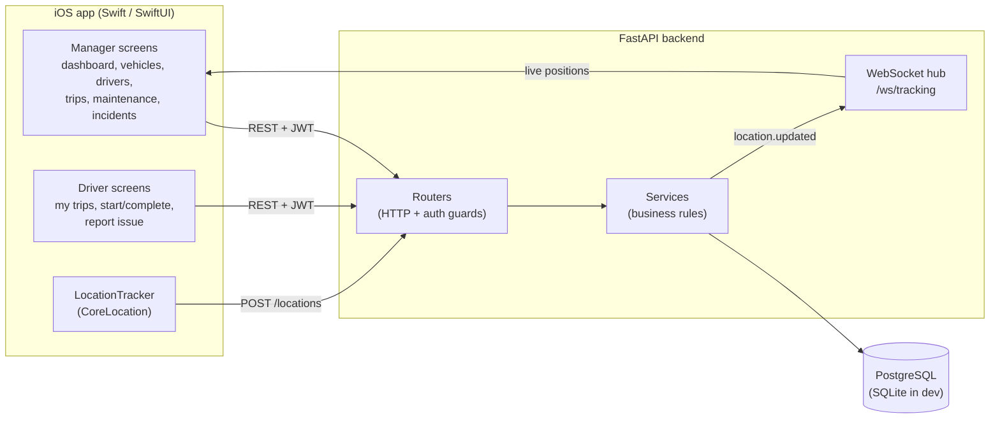
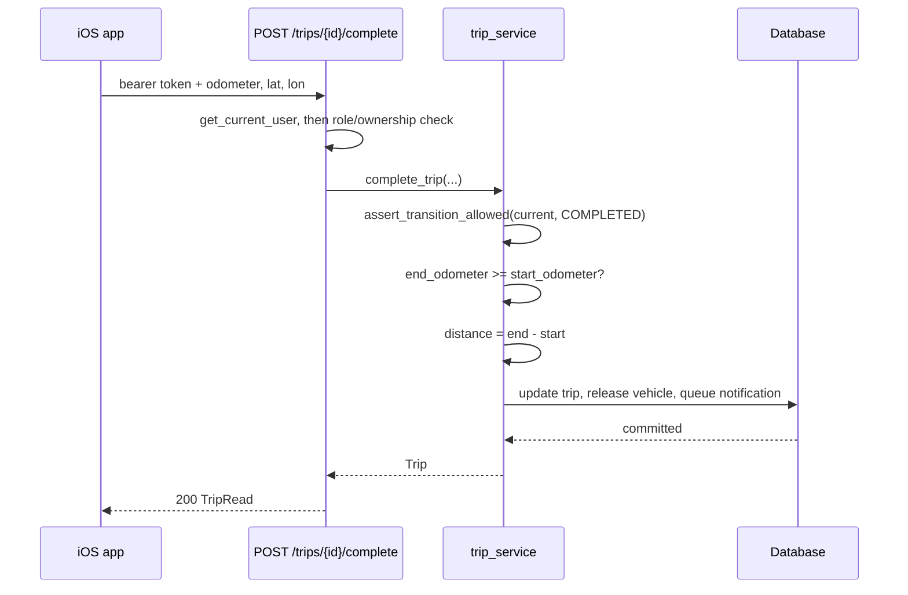
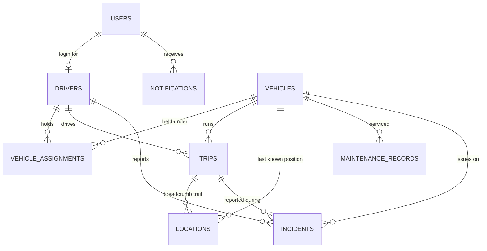

# Architecture

## System overview



## Layering

The backend is split into four layers, each depending only on the one below it:

| Layer | Directory | Responsibility |
|---|---|---|
| Routing | `app/api/routes/` | HTTP shape: paths, status codes, auth guards, pagination |
| Schema | `app/schemas/` | Request/response contracts and field-level validation |
| Service | `app/services/` | Business rules and invariants; the only layer that decides |
| Model | `app/models/` | SQLAlchemy tables, relationships and enums |

Routes stay thin on purpose: a route parses input, calls one service function, and
maps the result to a response model. Every rule that could be got wrong — an
assignment overlap, a trip transition, a distance calculation — lives in a
service function that can be tested without an HTTP client.

`app/core/` holds the cross-cutting pieces: settings, logging, password hashing
and JWT handling, and the `AppError` hierarchy that the exception handlers in
`app/main.py` turn into consistent JSON error bodies.

## Request flow

A representative write — a driver completing a trip:



If any assertion fails the service raises a `ConflictError` or `ValidationError`,
the handler in `main.py` renders `{"code": ..., "detail": ...}` with a 409 or 422,
and the iOS app surfaces `detail` next to the field the driver just filled in.

## Data model



Notes on the design:

- **`users` and `drivers` are separate tables.** Not every driver needs an app
  login (a fleet can track a driver who has no phone), and not every user is a
  driver. `drivers.user_id` is a nullable unique FK, so the link is optional and
  at most one-to-one.
- **`vehicle_assignments` is a range table, not a column on `vehicles`.** The
  brief asks to assign a vehicle "for a defined period" and to show driver
  history — both need the closed date ranges that a single `current_driver_id`
  column would throw away.
- **`locations` is append-only** and indexed on `(vehicle_id, recorded_at)` and
  `(trip_id, recorded_at)`, which are the two ways it is read: latest position
  per vehicle, and the ordered trail for one trip.
- **Denormalised `trips.distance_km`.** It is derived from the two odometer
  readings, but storing it keeps the dashboard's daily-distance sum a single
  aggregate rather than a per-row subtraction.

## iOS app structure

```
FleetManager/
├── Core/        APIClient, Session, Keychain, JSON coding, config
├── Models/      Codable mirrors of the API contract
├── Services/    FleetAPI facade, LocationTracker, TrackingSocket
└── Features/    SwiftUI screens, grouped by role
```

`Session` is the single source of truth for auth. It owns the tokens, exposes
the `signedOut / signedIn` state that `RootView` switches on, and implements
`TokenProviding` so `APIClient` can request a token and report an expired one
without either type knowing about SwiftUI.

Screens follow a light MVVM: the simple ones keep state in `@State` on the view;
the ones with real loading logic (dashboard, vehicle list) get an `@Observable`
view model. There is no view model for a screen that would do nothing but
forward calls.

## Real-time tracking

While a trip is active the driver app samples CoreLocation, throttles to one
ping every 15 seconds, and POSTs to `/locations`. The service writes the row and
publishes a `location.updated` event to every socket connected to
`/ws/tracking`; the manager's map applies it in place.

Uploads that fail are buffered in memory and retried through
`POST /locations/batch`, so a tunnel or a dead zone leaves a gap in timing but
not in the recorded trail.

The WebSocket hub is in-process, which is correct for a single instance. Running
several would need Redis pub/sub behind `ConnectionManager.broadcast`; the call
sites would not change.
